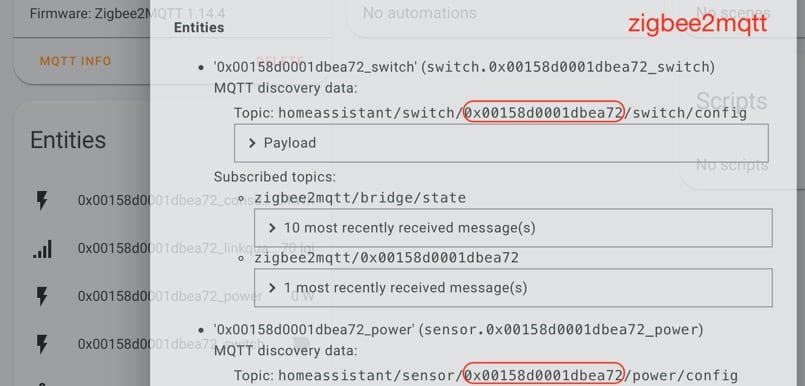
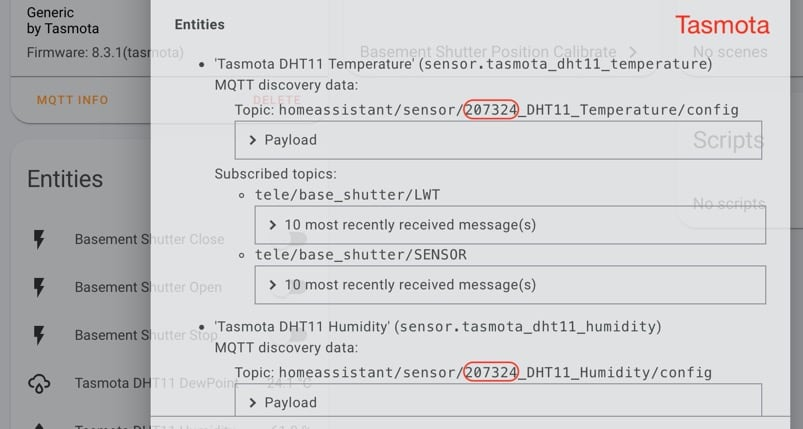

# MQTT Device Clean custom component for Home Assistant

###### by konnected.vn (https://konnected.vn -VI)

[![GitHub Release][releases-shield]][releases]
[![License][license-shield]](LICENSE.md)
[](https://github.com/custom-components/hacs)

![Project Maintenance][maintenance-shield]

## Goal

Custom service for Home Assistant to:

1. Clear all MQTT retained topics which are used to auto-configure a device or entity via mqtt auto-discovery function (https://www.home-assistant.io/docs/mqtt/discovery/)
2. Remove all device trigger related to removed device


## How to integrate it to Home Assistant?

### Copy component to Home Assistant

[](https://github.com/custom-components/hacs)

*HACS repo* add:

Add `github.com/konnectedvn/hass_mqtt_device_clean` to your HACS custom repositories under Integration category.

Search for `mqtt device clean` and install.

*Manually install*:

1. Create `mqtt_device_clean` folder inside your Home Assistant's`config/custom_components` (create new `custom_components` if not exists)
2. Copy all files inside `github.com/konnectedvn/hass_mqtt_device_clean/custom_components/mqtt_device_clean/` to new created `mqtt_device_clean` 

### Add component to Home Assistant configuration

Add line below inside your `/config/configuration.yaml`:

`mqtt_device_clean:`

## How to remove mqtt device in Home Assistant

**Firstly**, you have to remove your physical device from network:

1. Zigbee2mqtt:

   - ask your device to leave: [zigbee2mqtt docs](https://www.zigbee2mqtt.io/information/mqtt_topics_and_message_structure.html#zigbee2mqttbridgeconfigremove)

   - remove your device from database.db (inside zigbee2mqtt data folder)

     ```
     {"id":1,"type":"Coordinator","ieeeAddr":"0x00124b0014dl...}
     {"id":2,"type":"EndDevice","ieeeAddr":"0x00158d000429b...} <-- remove this line with identical ieeeAddr
     {"id":3,"type":"Router","ieeeAddr":"0x086bd7fff...}
     ```

   - OR using any assisted tools

2. Tasmota: remove your physical device from network or turn off discovery option `SetOption19 0`

After this step, your device will not operate anymore but still exists inside Home Assistant. Even after you remove it from entity registry, device will be auto-added in next Home Assistant or mqtt broker reboot.

**Secondly**, find your device_id from Home Assistant > Configuration > Integrations > MQTT > [your_device] > MQTT INFO






**Finally**, from Home Assistant > Developer Tools, call service `mqtt_device_clean.apply` with data:

```
device_id: 'your device_id'
discovery_topic: '(optional, defalt: homeassistant) your Home Assistant mqtt discovery prefix'
```


## Support (just for fun!)

Hey dude! Help me out for a couple of :beers: or a :coffee: (:coffee: is preferred, have enough beers this year)!
[](https://www.buymeacoffee.com/wolverinevn)

[maintenance-shield]: https://img.shields.io/maintenance/yes/2020.svg?style=for-the-badge
[twitter]: https://twitter.com/KonnectedVN
[site]: https://konnected.vn/home-assistant
[license-shield]: https://img.shields.io/github/license/konnectedvn/hass_mqtt_device_clean.svg?style=for-the-badge&color=red
[maintenance-shield]: https://img.shields.io/maintenance/yes/2020.svg?style=for-the-badge
[releases-shield]: https://img.shields.io/github/v/release/konnectedvn/hass_mqtt_device_clean.svg?style=for-the-badge&color=red
[releases]: https://github.com/konnectedvn/hass_mqtt_device_clean/releases
